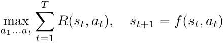
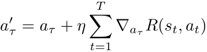
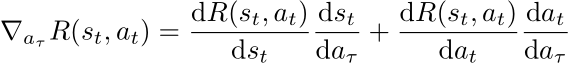
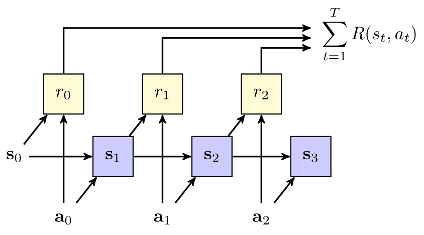
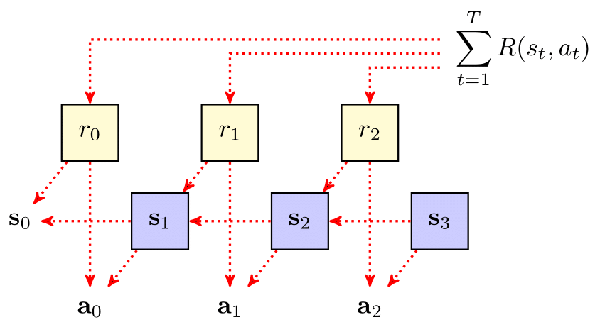
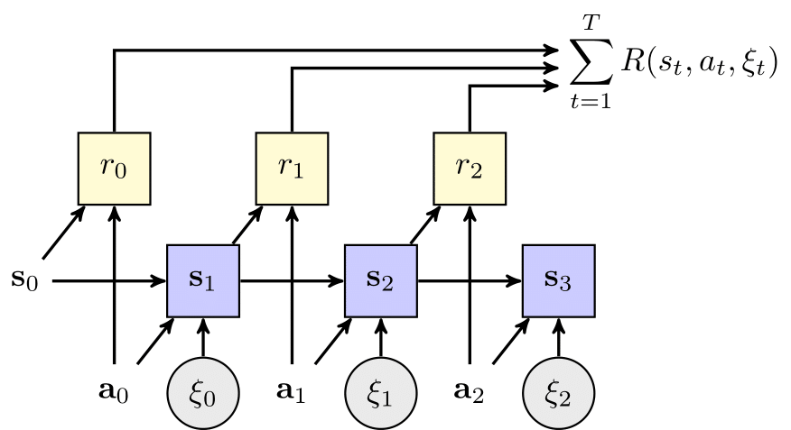
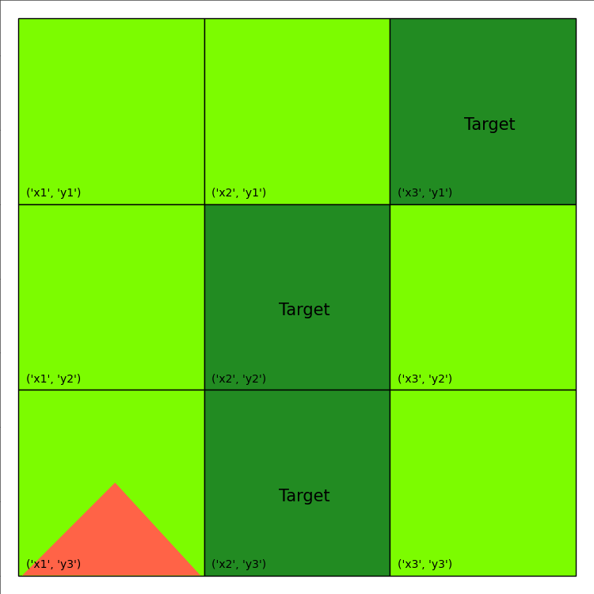

<p style="font-size:25px;text-align:left"><b>Baseline Planning Algorithm</b></p>

## Intro

The planning problem in a deterministic environment can be formulated as finding the action sequence that maximizes the sum of accumulated reward over a horizon of T time steps. Mathematically, 

<div style="width:100%;text-align:center;">
  <a href="images/backprop/PlanFwd.png">
    
  </a>
</div>

In continuous state-action MDPs, it is possible to obtain a reasonable solution using gradient ascent [[Ga Wu et al., 2017](https://proceedings.neurips.cc/paper/2017/file/98b17f068d5d9b7668e19fb8ae470841-Paper.pdf)] More concretely, given a learning rate parameter η and a "guess" a<sub>τ</sub>, gradient ascent obtains a new estimate of the optimal action

<div style="width:100%;text-align:center;">
  <a href="images/backprop/PlanBwd.png">
    
  </a>
</div>

where the gradient of the reward at all times t >= τ can be computed following the chain rule:

<div style="width:100%;text-align:center;">
  <a href="images/backprop/PlanBwd2.png">
    
  </a>
</div>

provided that the reward function and the CPF expression(s) are partially differentiable with respect to both arguments. 

The planning problem can also be described as a probabilistic graphical model (dynamic Bayes net). In the figure below, shaded square nodes represent results of intermediate calculations (e.g. CPFs and reward), and the non-shaded nodes represent inputs (initial state) and parameters (action sequence). The arrows indicate dependencies between nodes in a forward sampling procedure (e.g. simulation) from the given MDP. Here, we see that the state at any given time point depends on the state and action at the previous time step, and the reward depends on the state and action at the current time point.

<div style="width:100%;text-align:center;">
  <a href="images/backprop/GraphFwd.png">
    
  </a>
</div>

The backpropagation equation can also be described graphically. In the figure below, the arrows are reversed to show the flow of gradient information backward through the graph, starting from the return objective. 

<div style="width:100%;text-align:center;">
  <a href="images/backprop/GraphBwd.png">
    
  </a>
</div>

Finally, planning by backprop in stochastic domains is also possible by using the reparameterization trick. Here, a stochastic state transition function f can often be rewritten as a deterministic function of the current state, action and an i.i.d. noise generator ξ. 

<div style="width:100%;text-align:center;">
  <a href="images/backprop/GraphReparam.png">
    
  </a>
</div>

The baseline planner in pyRDDLGym automatically applies the reparameterization trick to RDDL expressions whenever it is possible. 

## Planning by Backpropagation with JAX

To run the JAX experiments, in addition to the basic requirements you will also need to install JAX, tensorflow and tensorflow-probability; we recommend installing the latest versions of these packages through pip. 

In order to get started with the JAX planner, a config file must first be generated that specifies all the parameters we wish to pass to the planner. Parameters include, for instance, the maximum number of gradient descent steps to perform, the batch size, and the learning rate. For example, let's look at the [Wildfire](/wildfire.md) domain and the instance file provided [here](https://github.com/ataitler/pyRDDLGym/tree/main/pyRDDLGym/Examples/Wildfire/instance0.rddl) which has 3 x 3 locations. The config file for this domain would look as follows

```shell
[Environment]
domain='Wildfire'
instance=0
enforce_action_constraints=True

[Optimizer]
key=42
optimizer='rmsprop'
optimizer_kwargs={'learning_rate': 0.01}
batch_size_train=32
batch_size_test=32
action_bounds={}
logic='ProductLogic'
logic_kwargs={'sigmoid_weight': 10}

[Training]
epochs=3000
step=100
```

Some config files are included in pyRDDLGym for your convenience; the file for the Wildfire problem can be found [here](https://github.com/ataitler/pyRDDLGym/tree/main/pyRDDLGym/Planner/Wildfire.cfg). 

The first thing we will do is to extract and initialize the domain info from the config file as follows:

```python
myEnv, planner, train_args = JaxConfigManager.get(f'Planner/Wildfire.cfg')
```

This tells the program to load the config in the Planner directory of pyRDDLGym. Next, we will instruct the planner instance to run gradient descent based on the arguments passed to it in the train_args dictionary:

```python
for callback in planner.optimize(**train_args):
    print('step={} train_return={:.6f} test_return={:.6f}'.format(
        str(callback['iteration']).rjust(4),
        callback['train_return'],
        callback['test_return']))
```

Here, the callback returns information such as the training and test losses, as well as the policy parameters at each iteration. The output of this training loop reveals that the loss decreases over the 3000 time steps. Also, please note that the training and test values can differ, for several reasons. First, pyRDDLGym must replace some exact non-differentiable operations (like logical and relational operations) with differentiable approximations. Second, pyRDDLGym applies a scaling function to the reward to normalize the gradients during training.

```
step=   0 train_return=-478.153992 test_return=-26938.281250
step= 100 train_return=-284.321472 test_return=-28319.062500
step= 200 train_return=-250.616150 test_return=-28244.531250
step= 300 train_return=-250.775360 test_return=-20951.093750
step= 400 train_return=-257.658936 test_return=-21951.406250
step= 500 train_return=-284.770538 test_return=-20313.281250
step= 600 train_return=-246.340790 test_return=-14479.218750
step= 700 train_return=-235.874786 test_return=-14213.281250
step= 800 train_return=-220.293549 test_return=-11667.812500
step= 900 train_return=-246.529114 test_return=-12981.562500
step=1000 train_return=-236.880386 test_return=-11137.343750
step=1100 train_return=-242.186203 test_return=-10302.343750
step=1200 train_return=-180.583572 test_return=-6831.718750
step=1300 train_return=-190.991333 test_return=-10312.187500
step=1400 train_return=-197.751190 test_return=-5266.250000
step=1500 train_return=-226.865143 test_return=-4949.531250
step=1600 train_return=-249.183212 test_return=-6689.375000
step=1700 train_return=-205.210342 test_return=-5630.156250
step=1800 train_return=-152.373840 test_return=-5019.218750
step=1900 train_return=-178.385605 test_return=-3283.906250
step=2000 train_return=-183.279007 test_return=-4152.968750
step=2100 train_return=-201.283920 test_return=-5048.281250
step=2200 train_return=-153.557739 test_return=-6380.937500
step=2300 train_return=-181.470856 test_return=-4957.656250
step=2400 train_return=-155.333572 test_return=-4047.031250
step=2500 train_return=-191.350815 test_return=-4580.937500
step=2600 train_return=-161.685699 test_return=-4440.156250
step=2700 train_return=-176.357559 test_return=-7938.593750
step=2800 train_return=-213.839828 test_return=-5086.250000
step=2900 train_return=-166.925598 test_return=-5025.781250
```

We will now use this to extract the policy parameters from the final callback in the training loop:

```python
plan = planner.get_plan(callback['params'])
```

Finally, we can test the resulting actions using the ordinary simulation loop:

```python
total_reward = 0
state = myEnv.reset()
for step in range(myEnv.horizon):
    myEnv.render()
    action = plan[step]
    next_state, reward, done, _ = myEnv.step(action)
    total_reward += reward 
    print()
    print('step       = {}'.format(step))
    print('state      = {}'.format(state))
    print('action     = {}'.format(action))
    print('next state = {}'.format(next_state))
    print('reward     = {}'.format(reward))
    state = next_state
    if done:
        break        
print(f'episode ended with reward {total_reward}')
myEnv.close()
```

This produces the following:

```
step       = 0
state      = {'burning_x1_y1': False, 'burning_x1_y2': False, 'burning_x1_y3': True, 'burning_x2_y1': False, 'burning_x2_y2': False, 'burning_x2_y3': False, 'burning_x3_y1': False, 'burning_x3_y2': False, 'burning_x3_y3': False, 'out-of-fuel_x1_y1': False, 'out-of-fuel_x1_y2': False, 'out-of-fuel_x1_y3': False, 'out-of-fuel_x2_y1': False, 'out-of-fuel_x2_y2': False, 'out-of-fuel_x2_y3': False, 'out-of-fuel_x3_y1': False, 'out-of-fuel_x3_y2': False, 'out-of-fuel_x3_y3': False}
action     = {'put-out_x1_y3': True}
next state = {'burning_x1_y1': False, 'burning_x1_y2': False, 'burning_x1_y3': False, 'burning_x2_y1': False, 'burning_x2_y2': False, 'burning_x2_y3': False, 'burning_x3_y1': False, 'burning_x3_y2': False, 'burning_x3_y3': False, 'out-of-fuel_x1_y1': False, 'out-of-fuel_x1_y2': False, 'out-of-fuel_x1_y3': True, 'out-of-fuel_x2_y1': False, 'out-of-fuel_x2_y2': False, 'out-of-fuel_x2_y3': False, 'out-of-fuel_x3_y1': False, 'out-of-fuel_x3_y2': False, 'out-of-fuel_x3_y3': False}
reward     = -15.0

...

step       = 99
state      = {'burning_x1_y1': False, 'burning_x1_y2': False, 'burning_x1_y3': False, 'burning_x2_y1': False, 'burning_x2_y2': False, 'burning_x2_y3': False, 'burning_x3_y1': False, 'burning_x3_y2': False, 'burning_x3_y3': False, 'out-of-fuel_x1_y1': True, 'out-of-fuel_x1_y2': True, 'out-of-fuel_x1_y3': True, 'out-of-fuel_x2_y1': True, 'out-of-fuel_x2_y2': False, 'out-of-fuel_x2_y3': False, 'out-of-fuel_x3_y1': False, 'out-of-fuel_x3_y2': True, 'out-of-fuel_x3_y3': True}
action     = {}
next state = {'burning_x1_y1': False, 'burning_x1_y2': False, 'burning_x1_y3': False, 'burning_x2_y1': False, 'burning_x2_y2': False, 'burning_x2_y3': False, 'burning_x3_y1': False, 'burning_x3_y2': False, 'burning_x3_y3': False, 'out-of-fuel_x1_y1': True, 'out-of-fuel_x1_y2': True, 'out-of-fuel_x1_y3': True, 'out-of-fuel_x2_y1': True, 'out-of-fuel_x2_y2': False, 'out-of-fuel_x2_y3': False, 'out-of-fuel_x3_y1': False, 'out-of-fuel_x3_y2': True, 'out-of-fuel_x3_y3': True}
reward     = 0.0

episode ended with reward -265.0

```

which is considerably better than a random policy.

## Re-Planning

In stochastic domains, the performance of an open-loop policy (e.g. a policy without continual feedback) can often perform sub-optimally. One way to incorporate such feedback during optimization is to calculate a new plan at each state of the rollout ("re-plan"). Often, the planning horizon is reduced in re-planning to reduce the computation time and performance of immediate actions. Fortunately, re-planning can be easily done in pyRDDLGym by slightly modifying the training procedure described above.

First, as before, we provide a config file to the planner that specifies the training parameters

```python
myEnv, planner, train_args = JaxConfigManager.get(f'Planner/Wildfire replan.cfg')
```

Next, we incorporate the planning directly into the simulation loop at each stage, as follows:

```python
total_reward = 0
state = myEnv.reset()
for step in range(myEnv.horizon):
    myEnv.render()
    * _, callback = planner.optimize(**train_args, init_subs=myEnv.sampler.subs)
    action = planner.get_plan(callback['params'])[0]
    next_state, reward, done, _ = myEnv.step(action)
    total_reward += reward 
    print()
    print('step       = {}'.format(step))
    print('state      = {}'.format(state))
    print('action     = {}'.format(action))
    print('next state = {}'.format(next_state))
    print('reward     = {}'.format(reward))
    state = next_state
    if done:
        break
print(f'episode ended with reward {total_reward}')
myEnv.close()
```

Let us disect the above code block. The lines:

```python
total_reward = 0
state = myEnv.reset()
for step in range(myEnv.horizon):
```

begin the rollout from the initial state and for the horizon specified in the instance.rddl file. The line:

```python
* _, callback = planner.optimize(**train_args, init_subs=myEnv.sampler.subs)
```

runs the gradient descent for the number of iterations specified in the config file, and storing the last callback with the most recent plan. The action to take in the current state can be extracted directly from this plan as follows:

```python
action = planner.get_plan(callback['params'])[0]
```

The remaining lines of code 

```python
next_state, reward, done, _ = myEnv.step(action)
total_reward += reward 
...
```

update the environment with the current action and the total reward accumulated. The visualization of this plan is provided below:

<div style="width:100%;text-align:center;">
  <a href="images/backprop/WildfireOpt.gif">
    
  </a>
</div>

The final print-out looks like this:

```
step       = 0
state      = {'burning_x1_y1': False, 'burning_x1_y2': False, 'burning_x1_y3': True, 'burning_x2_y1': False, 'burning_x2_y2': False, 'burning_x2_y3': False, 'burning_x3_y1': False, 'burning_x3_y2': False, 'burning_x3_y3': False, 'out-of-fuel_x1_y1': False, 'out-of-fuel_x1_y2': False, 'out-of-fuel_x1_y3': False, 'out-of-fuel_x2_y1': False, 'out-of-fuel_x2_y2': False, 'out-of-fuel_x2_y3': False, 'out-of-fuel_x3_y1': False, 'out-of-fuel_x3_y2': False, 'out-of-fuel_x3_y3': False}
action     = {'put-out_x1_y3': True}
next state = {'burning_x1_y1': False, 'burning_x1_y2': False, 'burning_x1_y3': False, 'burning_x2_y1': False, 'burning_x2_y2': False, 'burning_x2_y3': False, 'burning_x3_y1': False, 'burning_x3_y2': False, 'burning_x3_y3': False, 'out-of-fuel_x1_y1': False, 'out-of-fuel_x1_y2': False, 'out-of-fuel_x1_y3': True, 'out-of-fuel_x2_y1': False, 'out-of-fuel_x2_y2': False, 'out-of-fuel_x2_y3': False, 'out-of-fuel_x3_y1': False, 'out-of-fuel_x3_y2': False, 'out-of-fuel_x3_y3': False}
reward     = -15.0

...

step       = 99
state      = {'burning_x1_y1': False, 'burning_x1_y2': False, 'burning_x1_y3': False, 'burning_x2_y1': False, 'burning_x2_y2': False, 'burning_x2_y3': False, 'burning_x3_y1': False, 'burning_x3_y2': False, 'burning_x3_y3': False, 'out-of-fuel_x1_y1': False, 'out-of-fuel_x1_y2': True, 'out-of-fuel_x1_y3': True, 'out-of-fuel_x2_y1': True, 'out-of-fuel_x2_y2': False, 'out-of-fuel_x2_y3': False, 'out-of-fuel_x3_y1': False, 'out-of-fuel_x3_y2': True, 'out-of-fuel_x3_y3': True}
action     = {}
next state = {'burning_x1_y1': False, 'burning_x1_y2': False, 'burning_x1_y3': False, 'burning_x2_y1': False, 'burning_x2_y2': False, 'burning_x2_y3': False, 'burning_x3_y1': False, 'burning_x3_y2': False, 'burning_x3_y3': False, 'out-of-fuel_x1_y1': False, 'out-of-fuel_x1_y2': True, 'out-of-fuel_x1_y3': True, 'out-of-fuel_x2_y1': True, 'out-of-fuel_x2_y2': False, 'out-of-fuel_x2_y3': False, 'out-of-fuel_x3_y1': False, 'out-of-fuel_x3_y2': True, 'out-of-fuel_x3_y3': True}
reward     = 0.0

episode ended with reward -75.0
```

Therefore, re-planning achieves a much better total reward than the open-loop plan obtained earlier. 

<hr>
[Back to main page](index.md)

