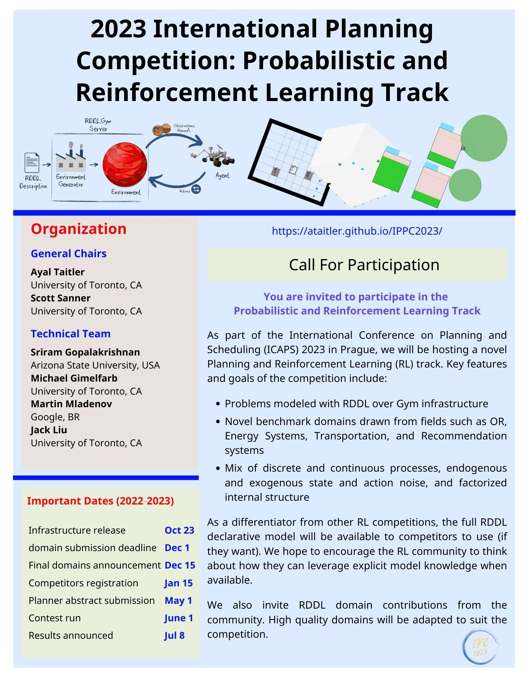
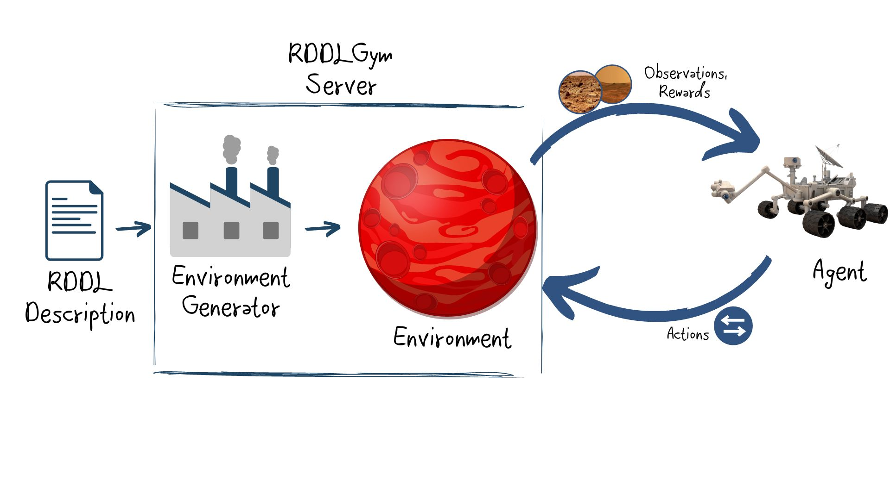
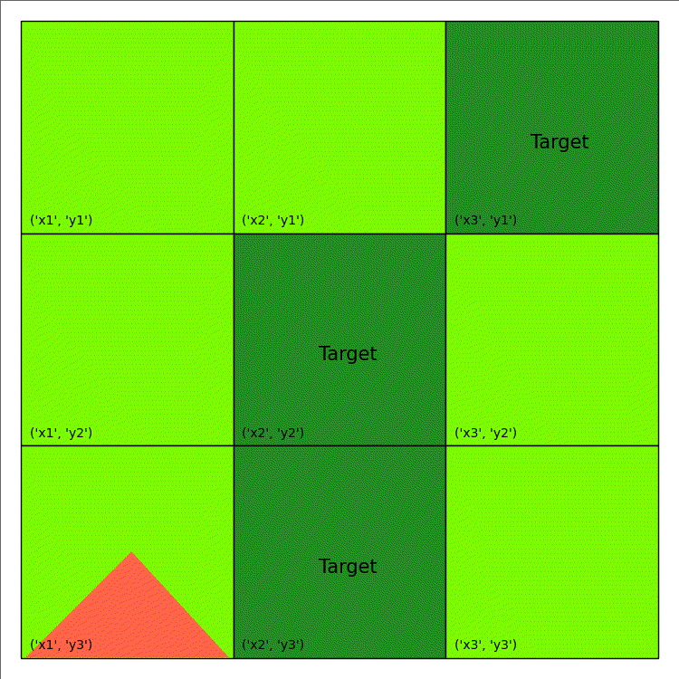
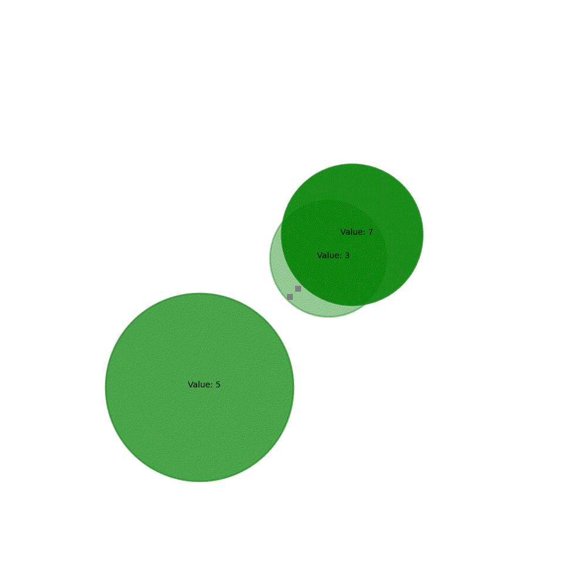
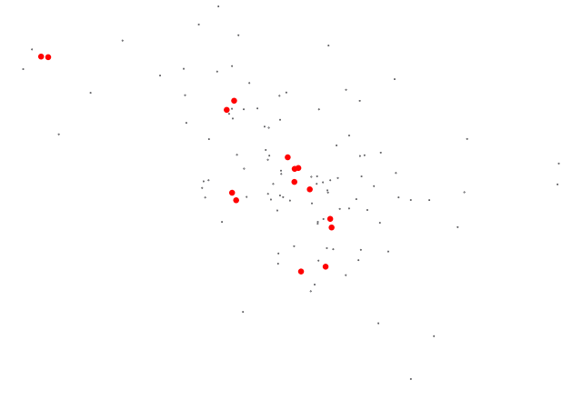
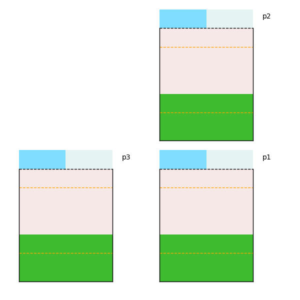
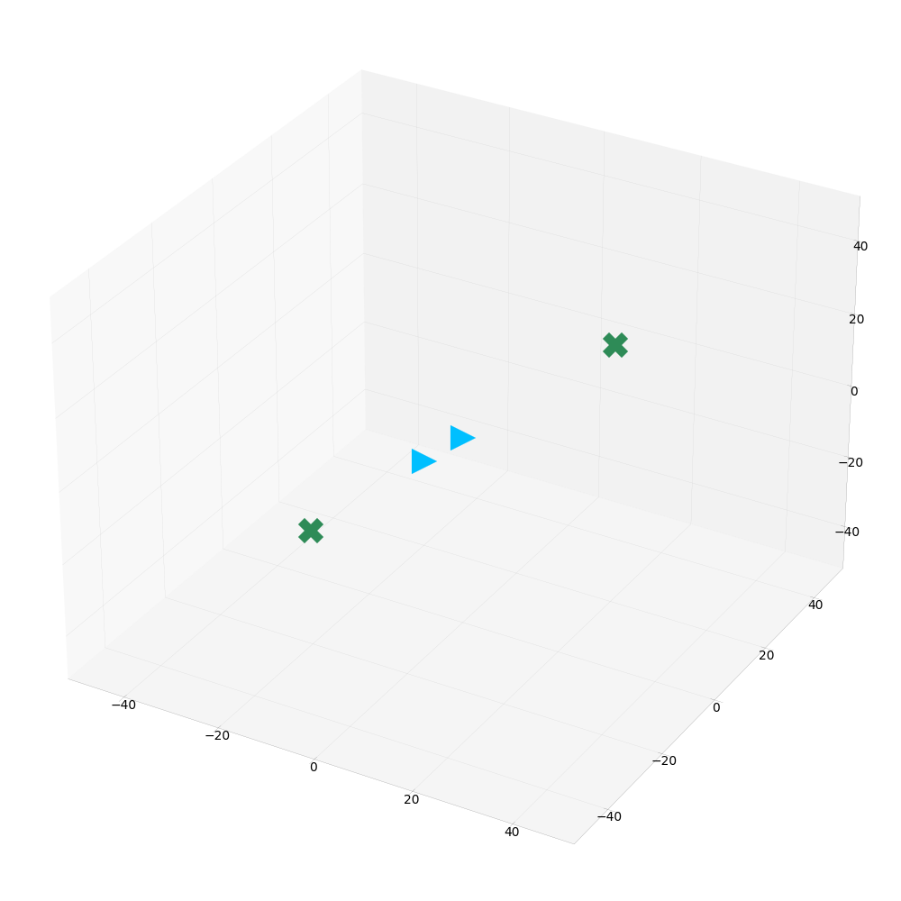
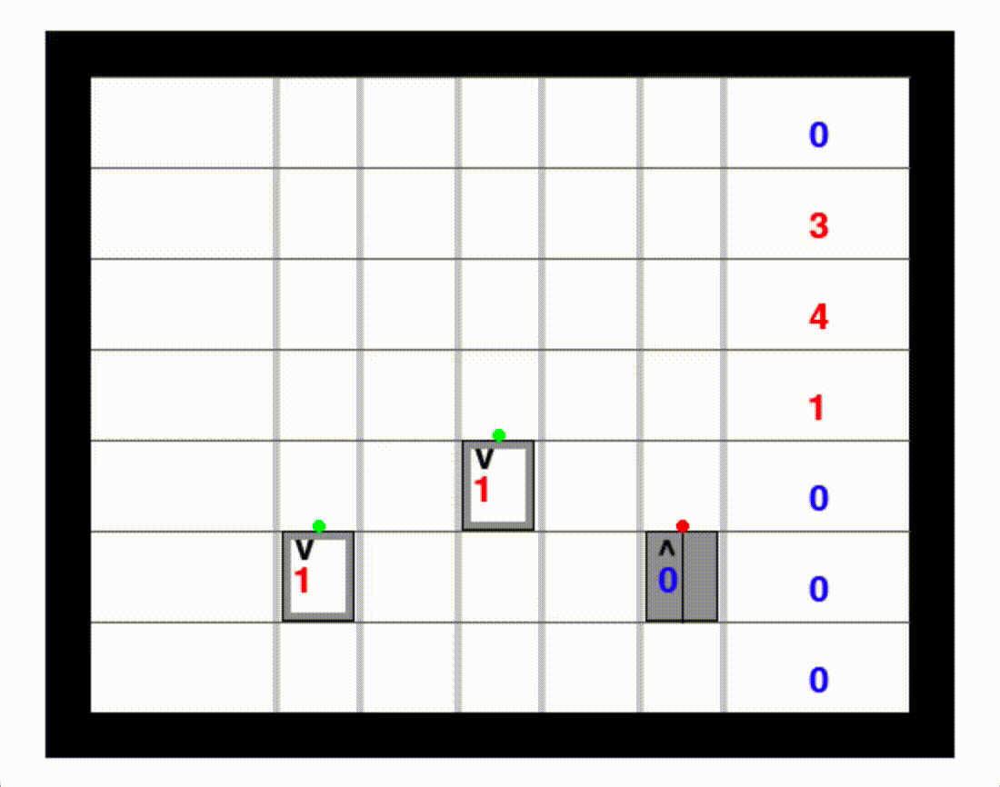
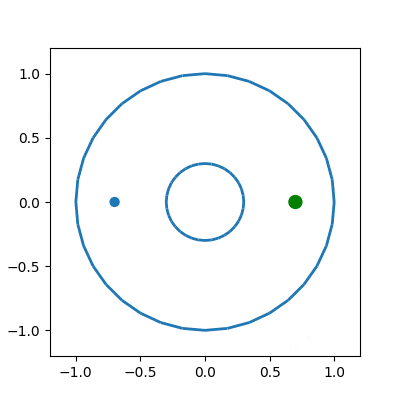

<p style="font-size:30px;text-align:center;line-height:100%"><b>Welcome to the International Planning Competition 2023: Probabilistic and Reinforcement Learning Track</b></p>


The International Probabilistic Planning Competition is organized in the context of the International Conference on Planning and Scheduling (ICAPS). It empirically evaluates state-of-the-art planning systems on a number of benchmark problems. The goals of the IPC are to promote planning research, highlight challenges in the planning community and provide new and interesting problems as benchmarks for future research.

Since 2004, probabilistic tracks have been part of the IPC under different names (as the International Probabilistic Planning competition or as part of the uncertainty tracks). After 2004, 2006, 2008, 2011, 2014, and 2018, the 7th IPPC will be held in 2023 and conclude together with ICAPS, in July 2023, in Prague (Czech Republic). This time it is organized by Ayal Taitler and Scott Sanner.


## Calls
Please forward the following calls to all interested parties:
- [Call for Participation and Domains](/call_email.md)

<div style="width:100%;text-align:center;">
  <a href="images/IPPC2023_Graphical_Call_V2.jpg">
    
  </a>
</div>

We invite interested competitors to join the competition discussion:

   [ippc2023-rddl@googlegroups.com](https://groups.google.com/g/ippc2023-rddl)

## Preliminary Schedule


| Event                                         | Date             |
|:----------------------------------------------|:-----------------|
| Infrastructure release with sample domains    | October, 2022    |
| Call for domains and praticipants             | October, 2022    |
| Final domains announcement                    | March 2, 2023    |
| Competitors registration deadline             | March 15, 2023   |
| Dry-run                                       | April 17, 2023   |
| Planner abstract dubmission                   | May 1, 2023      |
| Contest run                                   | June 5-8, 2023   |
| Final planner abstract dubmission             | June 13, 2023    |
| Results announced                             | July 11, 2023    |


## Setup

This year's competition will be using the generic pyRDDLGym - an autogeneration tool for gym environments from RDDL textual description.



More information about the infrastructure, how to use it and how to add user defined domains can be found the following short guide

- [Infrastructure guide](/infrastructure.md)

pyRDDLGym also comes with a set of auxiliary utils and baseline methods:

- [Tools and Baselines](/planning.md)


## Domains

We provide a sample of RDDL domains here and include a list of the eight Final Competition Domains further below. We still encourange the community to contribute user defined domains, or ideas you think the community should be aware of. While it will not make it into the current competition it will help enrich the the problem database, and be mature enough to be included in future competition.


<div class="image123" style="center">
  <div style="float:left;margin-right:5px;">
        <a href="wildfire.html">
        
        <p style="text-align:center;">Fire Fighting (from tutorial)</p>
        </a>
    </div>
    <div style="float:left;margin-right:5px;">
        <a href="rover.html">
        
        <p style="text-align:center;">Mars Rovers Science Mission</p>
        </a>
    </div>
    <div style="float:left;margin-right:5px;">
        <a href="recsim.html">
        
        <p style="text-align:center;">Recommendation Systems</p>
        </a>
    </div>
    <div style="float:left;margin-right:5px;">
        <a href="powergen.html">
        
        <p style="text-align:center;">Power Unit Commitment</p>
        </a>
    </div>
    <div style="float:left;margin-right:5px;">
        <a href="uav.html">
        
        <p style="text-align:center;">UAV</p>
        </a>
    </div>
    <div style="float:left;margin-right:5px;">
        <a href="elevator.html">
        
        <p style="text-align:center;">Elevator Control</p>
        </a>
    </div>
</div>


<br clear="left">

In addition to the original domain, we have recreated some of the classical control domains in RDDL. Illustrating how easy it is to generate domains in pyRDDLSim:

<div class="image123" style="center">
    <div style="float:left;margin-right:5px;">
        <a href="cartpole.html">
        
        <p style="text-align:center;">Cart Pole</p>
        </a>
    </div>
    <div style="float:left;margin-right:5px;">
        <a href="mountaincar.html">
        
        <p style="text-align:center;">Mountain Car</p>
        </a>
    </div>
  <div style="float:left;margin-right:5px;">
        <a href="racecar.html">
        
        <p style="text-align:center;">Race Car</p>
        </a>
    </div>
</div>

<br clear="left">

Note, that there are additional domains out there from past competitions (IPPC 2011, IPPC 2014), which can be also be used with pyRDDLSim:
- [IPPC 2011 domains](https://github.com/ssanner/rddlsim/tree/master/files/final_comp/rddl): This repository contains 8 domains: Elevators, Cross Traffic (Frogger), Game of Life, Navigation, Reconnaissance, Skill Teaching, SysAdmin, Traffic. 
- [IPPC 2014 domains](https://github.com/ssanner/rddlsim/tree/master/files/final_comp_2014/rddl): This repository contains some of IPPC 2011 domains, with additional 4 new domains: Tamarisk (Invasive Species), Wildfire (Firefighting), Academic Advising, Triangle Tireword.

Past competitions were entirely discrete; the focus of this year’s competition is on continuous and mixed discrete-continuous problems. However, everybody are welcome to take advantage of their existance. All previous competition domains are avilavble through the [rddlrepository](https://github.com/ataitler/rddlrepository) package/git.


## Registration

Registration for the competition is now closed.

A record number of groups have registered, we are expecting an amazing competition.

<!---Please register at the following link:

- [Registration form](https://forms.gle/W9ng4v3vciNcc9S27)

The registration will be closed on March 15, 2023. 
<!-- If you missed the deadline and wish to compete please contact one of the organizers (Ayal Taitler or Scott Sanner). -->

 
## Procedure

### Abstract Submission and Source Code

All competitors must submit a (maximum) 2 page abstract + unlimited references, describing their method.
We encourage the authors to release a public github link to their planner in their abstract.  If this github link is not provided in the abstract, it will be required by the final competition submission since the results of the competition winners will need to be independently verified by the competition organizers.
Please format submissions in AAAI style (see instructions in the [Author Kit](https://www.aaai.org/Publications/Templates/AuthorKit23.zip)), please use the camera ready version with the names and affiliations.

All abstracts must comply with the following requirements:
1. Provide a clear explanation of your method with appropriate citation. If external/off-the-shelf tools were used, provide a clear explanation of how and of any modification done for the purpose of the competition.
2. Provide a description of any manual prior knowledge intended to be used for the automatic tuning of your method (domain specific heuristics, etc.).
3. Provide a list of external libraries used (beyond standard python libraries, in particular any RL/planning libraries used in the solution.
4. Provide a clear explanation of the intended method to automatically and systematically tune your method before the competition starts (June 5th), and during the four days of the competition.


[Abstract submission](https://docs.google.com/forms/d/e/1FAIpQLScYZ1KDkk1a7A2thtNUEuf8YMcAn_xNyRCPP3MtHfX71FDwkQ/viewform?usp=sf_link), due May 1, 2023.


An important requirement for IPC 2023 competitors is to give the organizers the right to post their
paper and the source code of their learners/planners on the official IPC 2023 web site, and the source
code of submitted planners must be released under a license allowing free non-commercial use.


[Revised abstract submission](https://forms.gle/GWmCJq1rXEAHqFJp7), due June 13, 2023.

As a conclusion from the initial submission, we emphesize that all abstracts must comply with the instructions above. Think of the abstract as a short _2 pages + references_ paper presenting your method.
For your convenience we have created an example for an abstract, you can use it as template if you wish - [Latex](Abstracts/IPPC_Abstract_Example.zip) | [Word](Abstracts/IPPC_Abstract_Example.docx).


### Final Competition Domains

The competition will include:
- 8 domains (available now)
- 5 instances per domain (released at competition time)

| Domain                | pyRDDLGym name         |
|:----------------------|:-----------------------|
| Race Car              |  RaceCar               |
| Reservoir Control     |  Reservoir_continuous  |
| Recommender Systems   |  RecSim                |
| HVAC                  |  HVAC                  |
| UAV                   |  UAV_continuous        |
| Power Generation      |  PowerGen_continuous   |
| Mountain Car          |  MountainCar           |
| Mars Rover            |  MarsRover             |

Instance generators are available for all of these domains. The competition instances will be generated with these generators.
Documentation of the generators is available here:

- [Instance generators](/instancegen.md)


### Competition Dry-run

A mandatory stage for all competitors is to participate in a dry run of the competition.
This stage will test both the competition infrastructure and procedure and the competitors side to prevent problems and misunderstandings at competition time.

The dry run will take place on April 17th, during which a 24 hour window will be open for submission of the competing method. Each method will be executed on two domains, and two instances each. The domains for the dry-run will be HVAC and RaceCar.

The submission must include the ID of the competing team, unique permanent name of the competing method, and links to the github repository (optional) and dockerhub of the method image (mendatory). For technical instructions and further explanation please see

- [How to Dockerize your method](/Dockerization.md)

Note that the competition infrastructure will use the singularity infrastructure, and thus all dockers must use the template and follow the instruction on the link above to assure compatibility between the docker image and the competition infrastructure on our HPC.

We expect that your planner is capable of generating non-noop (potentially random) legal actions. The docker image and trace logs will be inspected to ensure that.

[Dry-run submission](https://docs.google.com/forms/d/e/1FAIpQLSdO7hi58arEZnvGw14pR6v46fObRoeorvyg1Uhjj3BNMWBmwg/viewform?usp=sf_link), due April 17, 2023.


### Competition Run and Logistics

The competition week will take place Monday-Thursday June 5 - June 8 2023. Starting June 5th 8:00 AM EDT,
3 instances will be release for all 8 domains. Competitors will have the 4 days to tune their 
methods for the 3 instances. At the end of the four days a docker image of maximum 2GB, with the 
tuned method will be submitted. All submissions must be finalized by June 8th 8:00 PM EDT.
Please make sure your submission is based on the template in the [demo NoOp docker example](https://github.com/ataitler/RDDL-demo-agent).

[Competition submission](https://forms.gle/CpaR6YSaA571ytuA8), due June 8th, 8 PM EDT 2023.

The competition version of pyRDDLGym, containing the competition instances is available at the pyRDDLGym git repository under the branch IPPC2023:

[Competition pyRDDLGym](https://github.com/ataitler/pyRDDLGym/tree/IPPC2023)

For the 4 days of the competition you will have access to 3 of the 5 evaluation instances through the IPPC2023 branch.
The instances will be indexed 1,3,5 while 2,4 are hidden and will be published only after the submission deadline has passed.
The instances are generally designed to be in increasing order of difficulty, with 1 being the easiest and 5 the hardest.
The competition instances have unique names: 'instance#c.rddl' (# stands for 1,3,5) at the pyRDDLGym examples tree.
The instances are accesible through the ExampleManager object as all other pyRDDLGym examples.
The following is an example how to access instance 1 of the competition of the 'HVAC' domain:

```python
from pyRDDLGym import RDDLEnv
EnvInfo = ExampleManager.GetEnvInfo('HVAC')
myEnv = RDDLEnv.RDDLEnv(domain=EnvInfo.get_domain(), instance=EnvInfo.get_instance('1c'))
```

For your convinience, we have added the file `InstGenExample.py` which contains generation code, and the parameters to each of the 3 competition instances.
The file is availalbe at the root folder of pyRDDLGym (with the `GymExample.py` file). Note that only the version in the IPPC2023 branch contains the competition parameters.

Competitors should self-report training specifications (how many machines and machine
specifications).

Manual encoding of explicity domain and instance knowledge is prohibited, 
you are however allowed to use domain specific heuristics and other automatic domain specific methods, as long as you report them.

Remark: we will use the same five instances at evaluation time in this edition of the competition in
order to facilitate reinforcement learning competitors who may need to learn per-instance.

An updated abstract containining any domain knowledge decleration, and the training specification must be submitted by June 13th, 2023

[Revised abstract submission](https://forms.gle/GWmCJq1rXEAHqFJp7), due June 13, 2023.


### Evaluation and Scoring

After June 8, 2023, competitor container submissions will be evaluated using an 8-core CPU (no GPU)
with 32Gb of RAM, on 50 randomized trials for each instance of the 8 competition domains.
The evaluation instances for each domain will include the 3 pre-released instances,
with additional 5 new never seen before instances - total of 5 instances per domain.

The average over all 50 trails will be taken as the raw score for each instance.

Normalized [0,1] instance scores will be computed according to the following lower and upper bounds:
- 0: max(noop policy, random policy).
- 1: max(JaxPlanner, best competing method).

A planner that does worse than 0 on this normalized scale will receive a 0. Each instance will have an hour (60 minutes) for general initilization, and then each trial will have 4 minutes
time limit; total of 60 + 50*4 = 260 minutes will be allocated per instance, with independent timers for each stage (you cannot use 200 minutes for initilaization and then do all the 50 episdoes in 60 minutes). failure to execute any trial (e.g., crash) for an instance or exceeding the time limit in any trial
for an instance will lead to overall normalized score of 0 for that instance. No competitor can exceed a
score of 1, by definition. Note that scoring less then 0 will result in rounding to zero (adversarial acting).

Normalized domain scores will be computed as an average of normalized instance scores.

An overall competition score will be computed as an average of normalized domain scores.


<!---### Results Announcement

By the competition registration deadline, we will release code for computing all scores above from
competition traces for each competitor.

At the ICAPS conference (July 8-13), we will announce winners per domain (by domain score) and an
overall winner (by competition score). At this time, we will also publicly release traces of all trails for
the competitors to allow reproduction and verification of score computations and to facilitate trace
analysis of competitors.
--->

### Results
The results were presented at the 33rd International Conference on Automated Planning and Scheduling ([ICAPS](https://icaps23.icaps-conference.org/)) on July 11 in Prague. The [presentation slides](/results/IPPC2023_results.pdf) of this talk contain additional details.

<h2 align="center">Winner</h2>

__DiSProD__ ([planner abstract](/results/IPCC_Abstract_Final_DiSProd.pdf), code TBD)
_Palash Chatterjee, Ashutosh Chapagain, Roni Khardon_
Indiana University, Bloomington


## Organizers
- [Ayal Taitler](https://sites.google.com/view/ataitler/home) (University of Toronto, CA)
- [Scott Sanner](https://www.mie.utoronto.ca/faculty_staff/sanner/) (University of Toronto, CA)

## Contributors
- [Michael Gimelfarb](https://mike-gimelfarb.github.io/) (University of Toronto, CA)
- [Jihwan Jeong](https://jihwan-jeong.netlify.app/) (University of Toronto, CA)
- [Sriram Gopalakrishnan](https://marirsg2.github.io/Sriram_Unravel/) (JP Morgan AI Research, USA)
- [Martin Mladenov](https://ataitler.github.io/IPPC2023/) (Google, BR)
- [Jack Liu](https://ataitler.github.io/IPPC2023/) (University of Toronto, CA)

Contact us: [ippc2023-rddl@googlegroups.com](https://groups.google.com/g/ippc2023-rddl)
